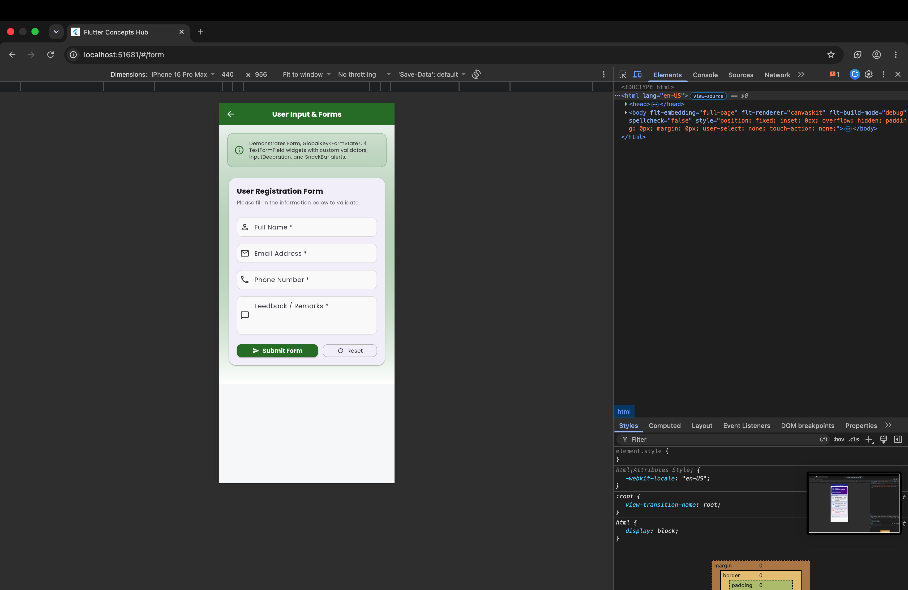
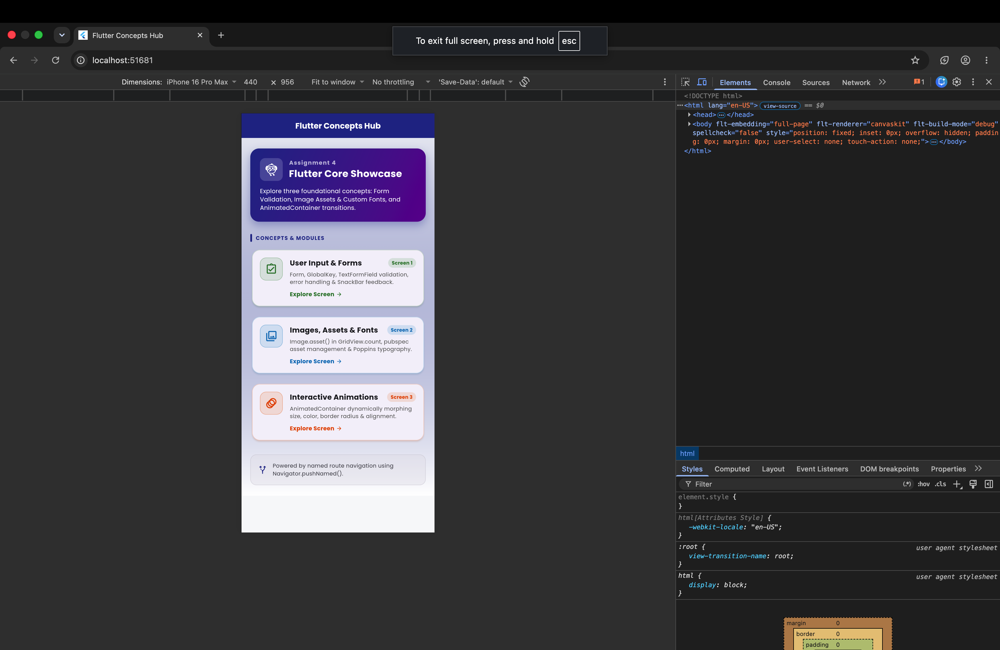
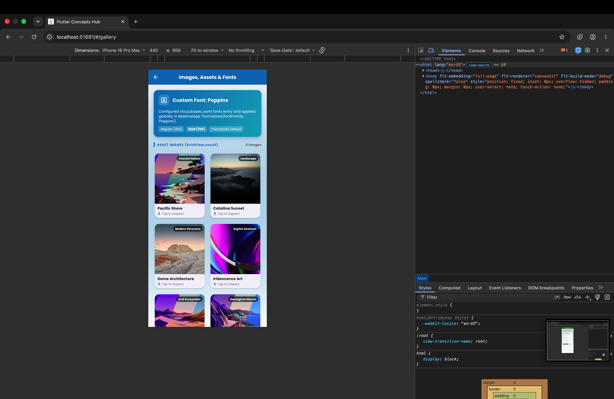
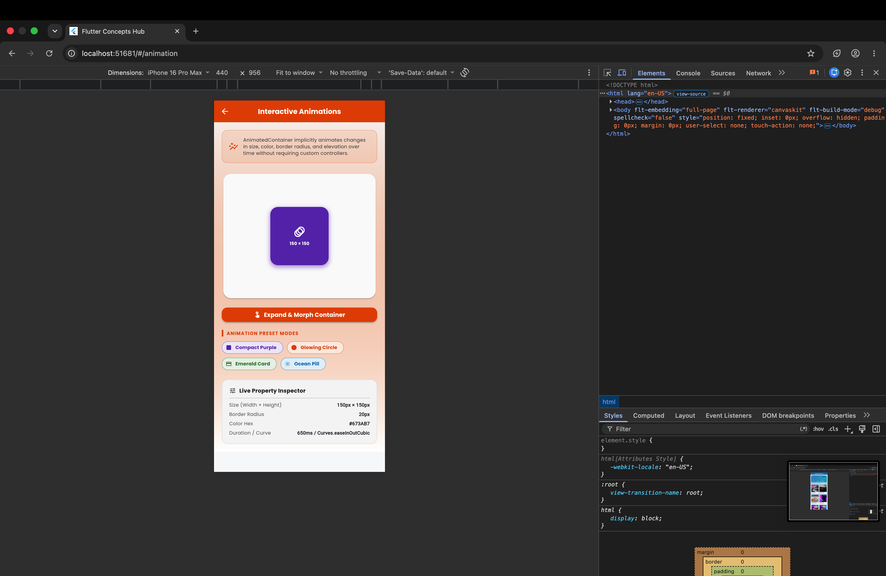

# Assignment 4 — Flutter Core Concepts Hub

A comprehensive Flutter application demonstrating three fundamental Flutter concepts within a unified, interactive project with named route navigation.

---

## 📱 Visual Showcase & Screenshots

| 1. Home Screen (Hub) | 2. User Input & Forms |
| :---: | :---: |
|  |  |
| **Named Route Navigation Hub** | **Form Validation & SnackBar** |

| 3. Images, Assets & Fonts | 4. Interactive Animations |
| :---: | :---: |
|  |  |
| **GridView.count & Poppins Font** | **AnimatedContainer Morphing** |

---

## 🏛️ Application Architecture & Navigation

```
                    HomeScreen ('/')
                        │
          ┌─────────────┼─────────────┐
          ▼             ▼             ▼
   User Input &    Images, Assets   Interactive
      Forms           & Fonts       Animations
     ('/form')      ('/gallery')   ('/animation')
          │             │             │
          ▼             ▼             ▼
     Form Screen    Image Grid    AnimatedContainer
```

Navigation is implemented using Flutter's **Named Routes**:
- `'/'`: `HomeScreen()` — Main hub with concept cards and descriptions.
- `'/form'`: `FormScreen()` — Form validation demonstration.
- `'/gallery'`: `ImageGridScreen()` — Local assets and custom font typography.
- `'/animation'`: `AnimationScreen()` — Smooth `AnimatedContainer` transitions.

---

## 🚀 Key Concepts Demonstrated

### 1. User Input & Form Validation (`/form`)
- **`Form` & `GlobalKey<FormState>`**: Validates all fields collectively and manages form state.
- **`TextFormField` (4 fields)**:
  - **Full Name**: Non-empty, minimum 3 characters, alphabetical validation.
  - **Email Address**: Regex validation for standard RFC email patterns.
  - **Phone Number**: Exact 10-digit numeric validation.
  - **Feedback / Remarks**: Multi-line field with minimum length requirement.
- **`TextEditingController`**: Controls input values and enables easy form reset.
- **`InputDecoration`**: Outlined borders, prefix icons, and helper texts.
- **`SnackBar`**: Styled floating SnackBar displaying success feedback upon submission and warning upon validation errors.
- **Reset Functionality**: Resets field states and controllers.

### 2. Images, Assets & Custom Fonts (`/gallery`)
- **Local Asset Management**: Configured in `pubspec.yaml` under `assets: - assets/images/`.
- **`Image.asset()`**: Renders high-quality bundled images with `BoxFit.cover` and error fallback widgets.
- **`GridView.count`**: 2-column responsive grid displaying images in rounded cards with category badges and captions.
- **Custom Google Font (`Poppins`)**: Bundled in `assets/fonts/` (Regular and Bold 700) and set globally via `ThemeData(fontFamily: 'Poppins')`.
- **Interactive Inspection**: Tapping any card opens a detailed preview dialog with image metadata and asset path.

### 3. Interactive Animations (`/animation`)
- **`AnimatedContainer`**: Implicit animation smoothly morphing across multiple properties simultaneously:
  - **Size**: Dynamic width & height (140px to 270px)
  - **Color**: Vibrant transition between Deep Purple, Orange, Emerald, and Ocean Blue
  - **Border Radius**: Sharp rectangle (16px) to pill (50px) to full circle (120px)
  - **Elevation & Shadow**: Animated blur radius and offset
- **Trigger Controls**: Primary toggle button + 4 preset chips (*Compact Purple*, *Glowing Circle*, *Emerald Card*, *Ocean Pill*).
- **Live Property Inspector**: Real-time display of current dimensions, radius, hex color, duration, and interpolation curve.

---

## 🛠️ Project Structure

```
4/
├── assets/
│   ├── fonts/
│   │   ├── Poppins-Bold.ttf
│   │   └── Poppins-Regular.ttf
│   └── images/
│       ├── abstract.jpg
│       ├── architecture.jpg
│       ├── cliffs.jpg
│       ├── desert.jpg
│       ├── mountains.jpg
│       └── nature.jpg
├── lib/
│   ├── main.dart
│   └── screens/
│       ├── animation_screen.dart
│       ├── form_screen.dart
│       ├── home_screen.dart
│       └── image_grid_screen.dart
├── test/
│   └── widget_test.dart
├── screenshots/
│   ├── 1_home_screen.png
│   ├── 2_form_screen.png
│   ├── 3_image_grid_screen.png
│   └── 4_animation_screen.png
├── pubspec.yaml
└── README.md
```

---

## 🏃 Running the Application

Ensure Flutter is installed and run:

```bash
cd 4
flutter pub get
flutter run
```

Or target specific platforms:
```bash
# macOS Desktop
flutter run -d macos

# Chrome Web
flutter run -d chrome
```

### Running Automated Tests
```bash
flutter test
```
