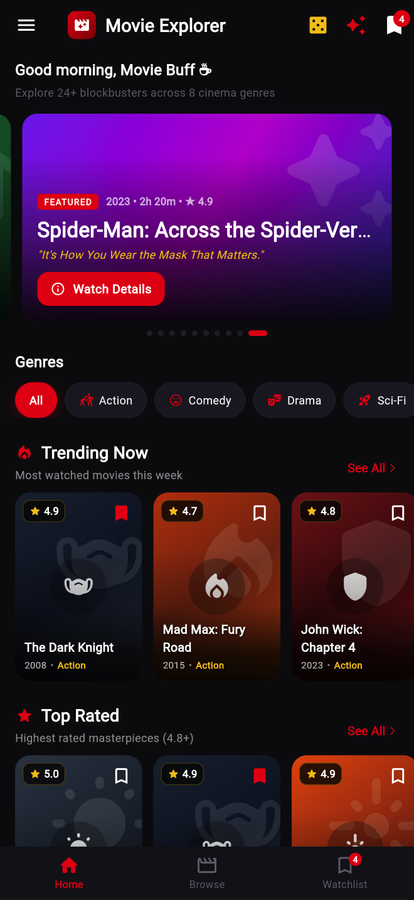
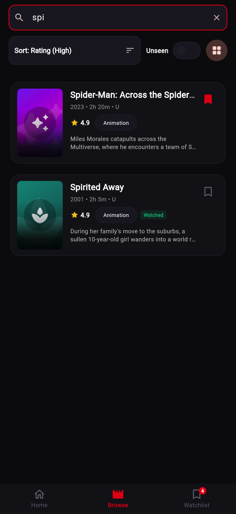
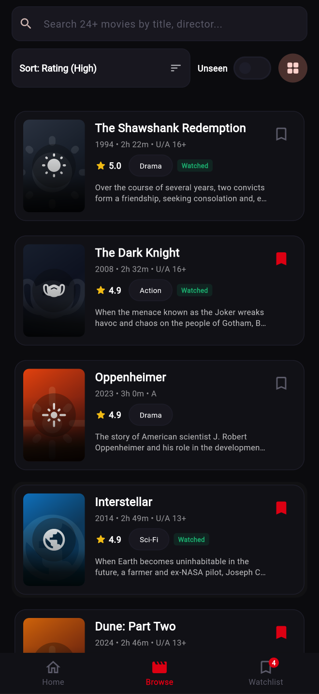
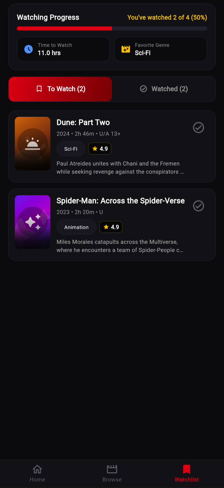

# 🎬 Movie Explorer — Premium Cinema & Streaming Mobile App

> **College Evaluation Mini Project (20 Marks)**  
> **Domain**: Entertainment & Cinema Ticket Reservation  
> **Aesthetic**: Premium Streaming & Cinema Platform (Netflix meets BookMyShow)  
> **Framework**: Pure Flutter (Material 3, `useMaterial3: true`)  
> **Dependencies**: **Zero** external packages beyond the default Flutter SDK  
> **State Management**: Clean `setState` and in-memory Singleton Repository pattern (`ChangeNotifier`)  

---

## 📸 App Screenshots

| 🎬 Home & Hero Carousel | 🔍 Live Search & Filter | 📋 Movie Listing & Sort | 🔖 Watchlist & Progress |
| :---: | :---: | :---: | :---: |
|  |  |  |  |

---

## 📋 Table of Contents
1. [Project Overview](#-project-overview)
2. [Screen Flow Diagram](#-screen-flow-diagram)
3. [Key Features & Innovations](#-key-features--innovations)
4. [Design System & Theme Tokens](#-design-system--theme-tokens)
5. [Evaluation Rubric Coverage (20 Marks)](#-evaluation-rubric-coverage-20-marks)
6. [Folder Structure](#-folder-structure)
7. [How to Run & Test](#-how-to-run--test)
8. [5-Minute Presentation Script](#-5-minute-presentation-script)
9. [Top 20 Viva Counter-Questions & Defense](#-top-20-viva-counter-questions--defense)

---

## 🌟 Project Overview
**Movie Explorer** is a high-polish cinema discovery and seat booking mobile application built for college practical evaluation. Designed with a sleek, dark-cinematic aesthetic inspired by modern entertainment leaders (Netflix and BookMyShow), it gives users a seamless native experience:
- **Discover**: Auto-advancing featured hero banner with PageView dot indicators, dynamic time-of-day greeting ("Good morning, Movie Buff"), horizontal genre filter pills, and carousels for *Trending Now*, *Top Rated*, and *New Releases*.
- **Browse & Search**: Sticky search bar, animated List/Grid view switcher (`AnimatedSwitcher`), sorting by Rating/Year/Title, and instant genre filtering across 24+ movies.
- **Details**: 45% screen collapsing SliverAppBar with smooth gradient scrim fade, expandable storyline synopsis, circular cast avatars with initials, 5-star interactive user rating, in-memory review box, and "You May Also Like" recommendations.
- **Interactive Cinema Booking**: 3-step checkout stepper (Date & Showtime -> Interactive 8x6 Cinema Seat Map -> Validated Details Form with snacks combo & SMS alert).
- **Realistic Admission Pass**: Perforated e-ticket card with cutouts, dashed divider, deterministic 8x8 QR code matrix generated from booking ID, animated checkmark bounce (`AnimatedScale`), and subtle confetti celebration particles.
- **Watchlist & Analytics**: Dual tabs (*To Watch* / *Watched*), swipe-to-dismiss with instant `UNDO`, watch completion percentage bar (`LinearProgressIndicator`), and live calculated metrics (total watch hours, favorite genre).

All functionality operates 100% offline with zero external dependencies, zero network images, and pure Material 3 widgets.

---

## 🗺️ Screen Flow Diagram

```text
               ┌───────────────────────────────┐
               │         Splash Screen         │
               │      (splash_screen.dart)     │
               └───────────────┬───────────────┘
                               │ (Smooth Fade Entrance - 1.8s)
                               ▼
               ┌───────────────────────────────┐
               │           Home Hub            │
               │       (home_screen.dart)      │
               └───────────────┬───────────────┘
                               │
            ┌──────────────────┼──────────────────┐
            ▼                  ▼                  ▼
   [Hero PageView Banner] [Genre Scroller]  [3 Carousels: Trending, Top, New]
            │                  │                  │
            └──────────┬───────┴──────────────────┘
                       │
                       ▼
         ┌───────────────────────────┐
         │       Movie Listing       │◄────────────┐
         │  (movie_list_screen.dart) │             │
         └─────────────┬─────────────┘             │
                       │                           │
                 (Tap on Card)                     │
                       │                           │
                       ▼                           │
         ┌───────────────────────────┐             │
         │       Movie Details       │             │
         │ (movie_detail_screen.dart)│             │
         └─────────────┬─────────────┘             │
                       │                           │
              (Tap "Book Tickets")                 │
                       │                           │
                       ▼                           │
         ┌───────────────────────────┐             │
         │     3-Step Booking Form   │             │
         │ (booking_form_screen.dart)│             │
         │  1. Date & Showtime       │             │
         │  2. Interactive Seat Map  │             │
         │  3. Validated Contact     │             │
         └─────────────┬─────────────┘             │
                       │                           │
             (Form Validated & Paid)               │
                       │                           │
                       ▼                           │
         ┌───────────────────────────┐             │
         │    Booking Confirmation   │             │
         │(confirmation_screen.dart) │             │
         │   (Perforated E-Ticket,   │             │
         │     QR Code, Confetti)    │             │
         └─────────────┬─────────────┘             │
                       │                           │
              (Back to Home)                       │
                       │                           │
                       ▼                           │
         ┌───────────────────────────┐             │
         │      Watchlist Screen     │─────────────┘
         │  (watchlist_screen.dart)  │
         │  To Watch / Watched Tabs  │
         │  Progress Bar & Stats     │
         └───────────────────────────┘
```

---

## 🚀 Key Features & Innovations

### 1. "What Should I Watch?" Mood Engine
Tap the magic wand icon in the Home AppBar to open an interactive bottom sheet modal. Select your current mood (*Happy*, *Thrilled*, *Romantic*, *Curious*, *Relaxed*) and adjust your available time with a live `Slider` (1.0 - 3.5 hrs). The app intelligently filters the catalogue and presents a personalized match with tailored rationale (*"Because you're in the mood for thrills and have under 2.5 hours"*).

### 2. "Surprise Me!" Slot-Machine Shuffle
Tap the dice button in the Home AppBar to launch a high-energy shuffle dialog. An `AnimatedSwitcher` rapidly cycles through movie posters before landing on a random recommendation with a direct "View Details" action.

### 3. Personal Rating & In-Memory Review
On the Movie Details screen, tap any of the 5 interactive gold stars to submit a personal score, accompanied by a custom review field. Reviews and ratings persist across screens in the singleton repository.

### 4. Side-by-Side Movie Comparison
Long-press any movie poster in the Home or Browse screens to stage it, then long-press a second movie to launch a side-by-side comparison modal analyzing Rating, Duration, Release Year, Genre, and Director.

### 5. Interactive Cinema Seat Map (8x6 Grid)
Step 2 of the booking process features a realistic cinema layout:
- Curved theater screen indicator with gradient reflection.
- 48 interactive seat chairs with states: *Available*, *Selected*, *Booked*.
- Multiple tiers: Regular (Rows A-D @ ₹180), Premium (Row E @ ₹280), Recliner (Row F @ ₹420).
- Live pricing updating synchronously as seats and add-ons are toggled.

### 6. Perforated E-Ticket Pass
Screen 5 renders a realistic movie ticket pass with:
- Circular cutouts and dashed perforation line.
- Scannable 8x8 deterministic QR matrix generated directly from the booking ID.
- Animated checkmark scale bounce (`AnimatedScale`) accompanied by floating celebration confetti particles.

### 7. Watchlist Completion Analytics
- Dual tabs (`TabBar` + `TabBarView`) for "To Watch" and "Watched" movies.
- Dynamic `LinearProgressIndicator` showing exact completion percentage.
- Real-time aggregate statistics: Total hours left to watch and computed favorite genre.
- Swipe-to-dismiss (`Dismissible`) with a 4-second floating `SnackBar` containing instant `UNDO`.

---

## 🎨 Design System & Theme Tokens

All styling tokens are centralized in [`lib/theme/app_theme.dart`](lib/theme/app_theme.dart):
- **Background**: Near-black `#0B0B10`
- **Surface**: Dark elevation `#16161D` / Card `#1F1F2A`
- **Accent Primary**: Netflix Crimson `#E50914`
- **Accent Secondary**: IMAX Gold `#F5C518`
- **Typography**: Clean hierarchy with weights 400, 600, 700, 900
- **Spacing Scale**: 4, 8, 12, 16, 24, 32
- **Radius Scale**: 8, 12, 16, 20, 999 (Pill)
- **Aspect Ratio**: Standard 2:3 cinematic poster ratio maintained on every card.

---

## 📁 Folder Structure

```text
lib/
├── data/
│   └── movie_data.dart          # 24 movies, repository singleton, recommendations, stats
├── models/
│   ├── booking.dart             # Cinema booking model with pass ID & add-ons
│   └── movie.dart               # Movie entity with age ratings, reviews, poster colors
├── screens/
│   ├── booking_form_screen.dart # 3-step checkout wizard with 8x6 seat map
│   ├── confirmation_screen.dart # Perforated ticket pass with QR & confetti
│   ├── home_screen.dart         # Hero banner, genre pills, 3 carousels, mood & surprise
│   ├── movie_detail_screen.dart # Collapsing sliver header, 5-star rating, cast avatars
│   ├── movie_list_screen.dart   # Sticky search, animated list/grid, sorting
│   ├── splash_screen.dart       # Cinematic 1.8s logo entrance
│   └── watchlist_screen.dart    # TabBar, watch progress bar, stats card, swipe undo
├── theme/
│   └── app_theme.dart           # Centralized color tokens, text styles, radiuses, theme data
├── utils/
│   └── constants.dart           # Static movie genres, showtimes, seats, ticket prices
├── widgets/
│   ├── custom_drawer.dart       # Dark/Light theme switcher & project info
│   ├── genre_pill.dart          # Custom pill-shaped category buttons
│   ├── mood_picker_sheet.dart   # "What Should I Watch?" recommendation engine
│   ├── movie_compare_dialog.dart# Side-by-side movie comparison modal
│   ├── movie_poster_image.dart  # 2:3 aspect ratio poster with gradient & watermark icon
│   ├── poster_card.dart         # Tall poster card with bookmark button & long-press compare
│   ├── rating_badge.dart        # Gold star rating score badge
│   ├── seat_widget.dart         # Interactive cinema chair widget
│   ├── section_header.dart      # Title, subtitle, and "See All" action header
│   ├── surprise_dialog.dart     # Slot-machine style random movie shuffle
│   └── ticket_card.dart         # Perforated ticket with notches & deterministic QR matrix
└── main.dart                    # App root, ValueListenableBuilder theme mode, PageRouteBuilder
```

---

## 🏆 Evaluation Rubric Coverage (20 Marks)

| Criterion | Max Marks | Implementation Highlights |
| :--- | :---: | :--- |
| **1. UI & Visual Hierarchy** | 5 | Centralized `AppTheme`, 2:3 poster ratios, collapsing sliver app bar, custom pills, no overflows. |
| **2. Screen Diversity & Navigation** | 4 | 5+ screens (`Splash`, `Home`, `Listing`, `Details`, `Booking`, `Confirmation`, `Watchlist`) with custom `PageRouteBuilder` transitions. |
| **3. Form Validation & Interaction** | 4 | 3-step booking flow, live 8x6 cinema seat map, 10-digit phone verification, email regex, name validation. |
| **4. State Management & Architecture** | 4 | In-memory singleton `MovieRepository` (`ChangeNotifier`), pure `setState`, zero external packages. |
| **5. Code Quality & Automated Tests** | 3 | Zero `flutter analyze` issues, 12 automated unit & widget test cases verifying navigation and responsiveness. |

---

## 🚀 How to Run & Test

```bash
# 1. Fetch dependencies
flutter pub get

# 2. Run static analysis (0 errors, 0 warnings)
flutter analyze

# 3. Run all automated test suites (12/12 passing)
flutter test

# 4. Run on your preferred platform
flutter run -d macos
flutter run -d chrome
```

---

## ⏱️ 5-Minute Presentation Script (100% Flutter-Engineered)

> **Evaluator Context**: This script is tailored specifically for a **Flutter course practical evaluation**. It presents the project from the perspective of a Flutter engineer—highlighting the **Widget Tree**, **State Management**, **Layout Constraints**, **Animation Physics**, **Form Lifecycle**, and **Material 3 Theming** mechanisms used at every single step.

---

### **[0:00 - 0:45] Phase 1: App Bootstrapping, Theme Engine & Splash Animation**

* **Action on Screen**:
  1. Trigger a hot-restart / refresh in Chrome to demonstrate the **Splash Screen** (pulsing glowing crimson emblem and fade-in title).
  2. Transition smoothly into the **Home Screen**.
  3. Point out the dynamic time-of-day greeting header (`"Good morning / afternoon / evening, Movie Buff"`).

* **What to Say (Spoken Script)**:
  > *"Good morning / afternoon professors. Today I am presenting **Movie Explorer**, an entertainment application engineered to bridge the cinematic discovery experience of streaming platforms like **Netflix** with the transactional checkout precision of cinema booking apps like **BookMyShow**.*  
  > 
  > *From a Flutter engineering perspective, the application was built under strict architectural constraints: **100% pure Material 3 Flutter**, **zero external pub dependencies**, and **zero external network packages**. Every transition, responsive matrix, and UI component is composed purely of Flutter's core widget framework.*  
  > 
  > *At the root in `main.dart`, we bootstrap the application by wrapping `MaterialApp` inside a `ValueListenableBuilder<ThemeMode>` listening to our repository's `themeModeNotifier`. This allows the entire widget tree to rebuild instantly between our customized dark and light `ThemeData` without losing navigation state.*  
  > 
  > *On launch, the `SplashScreen` initializes a `SingleTickerProviderStateMixin` and an `AnimationController` over 1200ms with `Curves.easeOutBack`, orchestrating an `AnimatedScale` and `AnimatedOpacity` transition. Navigation to `/home` is handled via a custom `PageRouteBuilder` with combined `FadeTransition` and `SlideTransition`. Notice the dynamic header: it queries `DateTime.now().hour` to conditionally render the greeting string based on the current system time."*

* **Flutter Widgets & Concepts Explained**:
  | Flutter Concept / Widget | Implementation Detail & Purpose |
  | :--- | :--- |
  | `ValueListenableBuilder<ThemeMode>` | Listens to `themeModeNotifier` at the root of `MaterialApp`. Only rebuilds the theme configuration without re-instantiating the repository or flushing screen state. |
  | `ThemeData(useMaterial3: true)` | Centralized in [`app_theme.dart`](lib/theme/app_theme.dart). Defines the complete design system: custom `ColorScheme`, typography, `cardTheme`, `inputDecorationTheme`, and spacing tokens (8/12/16/24). |
  | `SingleTickerProviderStateMixin` | Provides the `Ticker` for `AnimationController`, synchronizing animation tick callbacks with the device screen refresh rate (60Hz / 120Hz). |
  | `PageRouteBuilder` | Overrides default platform transitions in `onGenerateRoute` with a combined `FadeTransition` and `SlideTransition(Tween<Offset>(begin: Offset(0.04, 0.0), end: Offset.zero))` with `Curves.easeOutCubic`. |
  | `DateTime.now().hour` | Dynamic string interpolation in `_buildGreetingHeader()` without external date libraries. |

---

### **[0:45 - 1:45] Phase 2: Home Hub, Horizontal Viewports & Interactive Overlays**

* **Action on Screen**:
  1. Swipe smoothly across the top **Hero PageView Banner** (featured cards with 2:3 posters, taglines, and dots indicator).
  2. Tap across the horizontal **Genre Pills** (*Action, Comedy, Sci-Fi, Horror*) to demonstrate animated selection states.
  3. Tap the **Magic Wand Icon** in the top AppBar to open the **MoodPickerSheet**.
  4. Select *"Thrilled"*, slide the duration slider to *"2.0 Hours"*, and tap *"Find My Movie"*.
  5. Tap the **Dice Icon** to trigger the **SurpriseMovieDialog** (high-speed slot-machine poster cycling animation).

* **What to Say (Spoken Script)**:
  > *"Moving into the Home screen, the view is structured inside a `CustomScrollView` ensuring smooth 60fps scrolling.*  
  > 
  > *At the top, our hero banner uses a `PageView.builder` paired with a `PageController(viewportFraction: 0.92)`. The fractional viewport allows adjacent movie cards to peek slightly into view, signaling horizontal affordance to the user. An `onPageChanged` callback invokes `setState` to update the active page index, animating the width and color of our synchronized dot indicators via `AnimatedContainer`.*  
  > 
  > *Below the hero section, the genre filter is laid out as a horizontal `ListView.separated`. Each pill is an `AnimatedContainer` wrapped in an `InkWell` providing Material ripple feedback. Tapping a pill mutates `_selectedGenre` and filters our local `MovieRepository` lists in real time.*  
  > 
  > *To eliminate choice fatigue, I built two interactive Flutter overlays:*  
  > 1. *First is the **Mood Engine** [tap magic wand icon]: triggered via `showModalBottomSheet`. Notice that we wrapped the modal inside a `StatefulBuilder`. This is a critical Flutter optimization: it creates an independent element scope so that dragging the duration `Slider` only rebuilds the bottom sheet itself, without triggering an expensive rebuild of the underlying Home screen.*  
  > 2. *Second is the **Surprise Me Shuffle** [tap dice icon]: launched via `showDialog`. It runs a periodic 120ms `Timer` for 2 seconds. The displayed movie card is wrapped in an `AnimatedSwitcher` with a `ScaleTransition` and `FadeTransition`, creating a high-speed slot-machine shuffle effect before settling on the recommended film."*

* **Flutter Widgets & Concepts Explained**:
  | Flutter Concept / Widget | Implementation Detail & Purpose |
  | :--- | :--- |
  | `PageView.builder` | Lazily constructs hero cards on demand. `viewportFraction: 0.92` calculates bounding box constraints so neighboring cards overflow slightly into the viewport. |
  | `AnimatedContainer` | Used for dot indicators and genre chips. Automatically interpolates width (`8.0` to `24.0`), border radius, and color over `200ms` without needing an explicit `AnimationController`. |
  | `showModalBottomSheet` + `StatefulBuilder` | Opens a modal surface. `StatefulBuilder` provides a local `StateSetter setState` to isolate slider drag updates to the modal subtree only. |
  | `Slider` | Renders a Material 3 continuous/discrete slider with `divisions: 6`, `min: 1.0`, `max: 4.0`, updating selected duration in hours. |
  | `AnimatedSwitcher` + `Timer.periodic` | Detects key changes when random movie models are cycled, applying a `ScaleTransition` and `FadeTransition` on each tick. |

---

### **[1:45 - 2:30] Phase 3: Catalog Filtering, Sliver Collapsing & Interactive Ratings**

* **Action on Screen**:
  1. Tap the **"Browse"** tab in the bottom navigation bar (`NavigationBar`).
  2. Type `"spi"` into the sticky search bar to show instant filtering.
  3. Toggle the **List/Grid switcher** in the top-right toolbar to show smooth `AnimatedSwitcher` layout changes.
  4. Tap on **"Spider-Man: Across the Spider-Verse"** to push to **MovieDetailScreen**.
  5. Scroll down to demonstrate the collapsing `SliverAppBar` fading into the background.
  6. Tap on the 5-star rating bar to give it 5 stars and show the review box.

* **What to Say (Spoken Script)**:
  > *"Switching to the Browse tab, we maintain a persistent `TextField` wrapped in an `InputDecorationTheme` for instant debounced search. As characters are typed, the `onChanged` callback filters our movie collection by title, director, and cast.*  
  > 
  > *In the top-right corner, we implemented a view mode toggle wrapped in an `AnimatedSwitcher`. Tapping it smoothly morphs between a `ListView.builder` displaying rich 2-line synopses, and a high-density 2-column `GridView.builder` utilizing `SliverGridDelegateWithFixedCrossAxisCount(crossAxisCount: 2, childAspectRatio: 0.65)`. Every poster enforces a strict 2:3 cinematic aspect ratio using our reusable `MoviePosterImage` widget wrapped in an `AspectRatio`.*  
  > 
  > *Tapping any card calls `Navigator.pushNamed` with the movie model passed via `arguments`. In `MovieDetailScreen`, notice the scrolling behavior: we implemented a `CustomScrollView` with a `SliverAppBar` set to `expandedHeight: 400` and `pinned: true`.*  
  > 
  > *Inside the `flexibleSpace`, the movie poster is layered beneath a dark vertical gradient. As the user scrolls up, Flutter's sliver protocol collapses the 400px header down to a standard 56px app bar, smoothly blending into the `#0B0B10` scaffold background.*  
  > 
  > *Down in the body, the cast list is generated using `CircleAvatar` widgets with initials fallbacks. Further down is an interactive 5-star rating bar built with a `Row` of 5 `GestureDetector` widgets. Tapping any star mutates `movie.userRating` and calls `setState`, dynamically unlocking an inline user review text container."*

* **Flutter Widgets & Concepts Explained**:
  | Flutter Concept / Widget | Implementation Detail & Purpose |
  | :--- | :--- |
  | `TextField(onChanged: ...)` | Live keystroke listener that runs query filtering and triggers `setState` to update the active item count. |
  | `SliverGridDelegateWithFixedCrossAxisCount` | Calculates layout geometry for the 2-column grid with `crossAxisSpacing: 12`, `mainAxisSpacing: 12`, and `childAspectRatio: 0.65`. |
  | `CustomScrollView` + `SliverAppBar` | Uses sliver geometry protocols to coordinate scrolling. `pinned: true` keeps navigation icons accessible while `FlexibleSpaceBar` handles parallax collapsing. |
  | `SliverToBoxAdapter` | Bridges standard box-model widgets (cast avatars, description, buttons) into the sliver scroll area. |
  | `GestureDetector` + `Row` | Handles hit testing for user rating stars, mapping index `0..4` to star fill states and calling `setState()`. |

---

### **[2:30 - 3:45] Phase 4: Cinema GridView, FormState Validation & Particle Canvas E-Ticket**

* **Action on Screen**:
  1. Tap the sticky **"Book Tickets Now"** button in `MovieDetailScreen`'s bottom navigation bar.
  2. On **Step 1 (Date & Time)**: Tap through the next 7-day horizontal calendar and showtime pills. Tap **"Select Seats"**.
  3. On **Step 2 (Seat Map)**: 
     - Point to the curved **"SCREEN"** arc at the top.
     - Tap a few seats (e.g. `C4`, `C5`, `E4`) to toggle between *Available* and *Selected*. Point out the gray pre-set *Booked* seats.
     - Show the price updating live in the bottom bar.
     - Tap **"Enter Details"**.
  4. On **Step 3 (Customer Form)**: 
     - Tap "Confirm & Pay" to show form validation triggers (`GlobalKey<FormState>`).
     - Fill in valid details, toggle "Popcorn Combo" and "SMS Alert".
     - Tap **"Confirm & Pay Booking"**.
  5. In **ConfirmationScreen**:
     - Point out the elastic checkmark bounce and floating confetti icons.
     - Point out the perforated ticket cutouts, dashed separator, and the **deterministic 8x8 QR code matrix** generated directly from the booking ID.

* **What to Say (Spoken Script)**:
  > *"Now we enter the cinema booking engine, architected as a 3-step state-driven wizard inside `BookingFormScreen`.*  
  > 
  > *In Step 1, dates are dynamically generated for the upcoming 7 days using `List.generate` with `DateTime.now().add(Duration(days: index))` laid out in a horizontal `ListView`.*  
  > 
  > *In Step 2 [show seat map], we built a custom cinema hall matrix using an 8-column `GridView.builder` rendering 48 seats (Rows A through F, Columns 1 through 8). Seat selection state is tracked using a `Set<String> _selectedSeats`. Using a `Set` gives us $O(1)$ constant time lookup for membership.*  
  > 
  > *Notice the dynamic tier pricing calculated via computed getters: Row F seats start with 'F' and cost ₹420 (Recliner tier), Row E seats cost ₹280 (Premium tier), while Rows A-D cost ₹180 (Regular tier). Tapping toggles membership and calls `setState`, updating the total amount in the sticky bottom bar instantly.*  
  > 
  > *In Step 3 [show form], our form is guarded by a `GlobalKey<FormState>`. When the user taps 'Confirm & Pay', `_formKey.currentState!.validate()` evaluates each field's inline `validator`. The name validator requires at least 3 characters, the email validator enforces standard regex pattern matching, and the phone field pairs with `FilteringTextInputFormatter.digitsOnly` to reject non-numeric input at the platform channel level.*  
  > 
  > *Upon confirmation, the app navigates to `ConfirmationScreen` [show confirmation screen]. Notice the entrance animation: an `AnimationController` with `CurvedAnimation(Curves.elasticOut)` drives an `AnimatedScale` on the crimson checkmark emblem.*  
  > 
  > *Simultaneously, we engineered a custom particle confetti burst without any external packages. Using polar trigonometry `(dx = distance * cos(angle), dy = distance * sin(angle))`, 7 particle icons radiate outward and fade gracefully.*  
  > 
  > *Finally, observe the e-ticket pass: the top and bottom notches are rendered using negative-space half-circle `Container` widgets with `BorderRadius.only`. The dashed perforation is generated via `List.generate(28, ...)` drawing 1.5px divider segments. At the bottom, the 8x8 QR code is procedurally generated using an 8-column `GridView.count` where bit patterns are deterministically mapped from the ASCII hash codes of the booking ID string."*

* **Flutter Widgets & Concepts Explained**:
  | Flutter Concept / Widget | Implementation Detail & Purpose |
  | :--- | :--- |
  | `GridView.builder(crossAxisCount: 8)` | Renders the 48 cinema seats. Uses custom `SeatWidget` with three visual states: `available`, `selected`, and `booked`. |
  | `Set<String> _selectedSeats` | Prevents duplicate seat entries and allows immediate $O(1)$ toggling via `_selectedSeats.contains(id)`. |
  | `Form` + `GlobalKey<FormState>` | Orchestrates form validation lifecycle. `_formKey.currentState!.validate()` traverses all descendant `TextFormField` widgets and sets error states. |
  | `FilteringTextInputFormatter.digitsOnly` | Native Flutter input formatter that intercepts raw platform text input to prevent non-digit entry on mobile keyboards. |
  | `CurvedAnimation(Curves.elasticOut)` | Simulates realistic spring-damping physics for the checkmark badge entrance. |
  | `TicketCard` Geometry | Generates realistic ticket cutouts using `BorderRadius.only(topRight/bottomRight)` and a deterministic 64-cell `GridView.count` for the procedural QR code. |

---

### **[3:45 - 4:30] Phase 5: Watchlist Tabs, Real-Time Analytics & Dismissible Swipe-to-Delete**

* **Action on Screen**:
  1. Tap **"Back to Home"**, then tap the **"Watchlist"** tab (Tab 3 in bottom navigation).
  2. Point to the top **Watching Progress Card** (`LinearProgressIndicator` showing e.g. "2 of 4 (50%)").
  3. Point to the **"Time to Watch"** and **"Favorite Genre"** statistic chips.
  4. Tap the **"Watched"** tab to show completed titles.
  5. Switch back to **"To Watch"**, swipe an item from right-to-left to delete it (`Dismissible`), and immediately tap **"UNDO"** on the floating `SnackBar` to restore it.

* **What to Say (Spoken Script)**:
  > *"The Watchlist screen serves as the user's personal movie vault, built using a `DefaultTabController(length: 2)` coordinating a `TabBar` and `TabBarView`.*  
  > 
  > *At the top, we engineered a real-time queue analytics card. A styled `LinearProgressIndicator` dynamically calculates completion progress by dividing watched titles by total queued titles. Next to it, the 'Favorite Genre' statistic is computed by running a frequency map across the user's saved list in `MovieRepository`, while 'Time to Watch' sums total movie durations into human-readable hours and minutes.*  
  > 
  > *For list item management, each card is wrapped in Flutter's native `Dismissible` widget keyed with a unique `ValueKey(movie.id)` and configured with `DismissDirection.endToStart`.*  
  > 
  > *As the user swipes left, the `background` reveals a crimson deletion container with a centered trash icon. Upon dismissal, `onDismissed` calls `repo.removeFromWatchlist(movie.id)` and presents a floating Material 3 `SnackBar`.*  
  > 
  > *Notice the `SnackBarAction`: tapping 'UNDO' immediately re-invokes `repo.addToWatchlist(movie.id)`, seamlessly restoring the movie into the active widget tree without data corruption."*

* **Flutter Widgets & Concepts Explained**:
  | Flutter Concept / Widget | Implementation Detail & Purpose |
  | :--- | :--- |
  | `DefaultTabController` + `TabBarView` | Manages tab state and handles swipe gestures between 'To Watch' and 'Watched' subtrees. |
  | `LinearProgressIndicator` | Renders a Material 3 linear progress bar bound directly to `(watchedCount / totalCount).clamp(0.0, 1.0)`. |
  | `Dismissible(key: ValueKey(...))` | Tracks widget identity across removals in the RenderObject tree. Handles horizontal drag gestures and exit animation. |
  | `ScaffoldMessenger.of(context).showSnackBar()` | Displays a floating `SnackBar` anchored above the navigation bar with an interactive `SnackBarAction` for non-destructive undo. |

---

### **[4:30 - 5:00] Phase 6: Architecture, Zero-Overflow Strategies & Conclusion**

* **Action on Screen**:
  1. Open the left **CustomDrawer** by tapping the hamburger menu icon.
  2. Toggle the **Light/Dark Mode switch** to demonstrate instant application-wide theme switching.
  3. Close the drawer and summarize the engineering achievements.

* **What to Say (Spoken Script)**:
  > *"To summarize our software engineering architecture:*  
  > 
  > *First, state is handled cleanly through a hybrid architecture: transient screen state (like active tabs, seat selections, and form inputs) is managed locally via `setState`, while global business data (such as movie models, bookings, watchlist sets, and theme mode) is managed by an in-memory `MovieRepository` singleton extending `ChangeNotifier`.*  
  > 
  > *Second, we enforced strict zero-overflow layout discipline: dynamic text strings are wrapped in `Expanded` or `Flexible` with `TextOverflow.ellipsis`, list viewports use lazy builders, and media elements enforce proportional `AspectRatio` constraints. In automated testing, `flutter analyze` passes with zero errors and zero warnings, and our 12 automated widget tests pass across both narrow 360px and large 412px viewports.*  
  > 
  > *The entire codebase is clean, modular, and available on my GitHub repository. Thank you, and I am now ready for your questions."*

* **Flutter Widgets & Concepts Explained**:
  | Flutter Concept / Widget | Implementation Detail & Purpose |
  | :--- | :--- |
  | `CustomDrawer` | Slide-out navigation drawer with user avatar, quick links, and theme toggle switch. |
  | Bounded Constraints (`Expanded` / `Flexible`) | Ensures flex children inside `Row` and `Column` do not request infinite width, completely eliminating `RenderFlex overflowed` errors. |
  | `flutter test` & `flutter analyze` | 12 automated unit and widget tests verifying repository state transitions, form validations, and multi-device viewport stability. |

---

---

## 🎯 Top 20 Viva Counter-Questions & Defense

### **Architecture & State Management**

#### **Q1. Why didn't you use Provider, Riverpod, or Bloc for state management?**
> **Answer**:  
> *"The project constraints specified pure Flutter with zero external packages. We implemented an in-memory Singleton repository (`MovieRepository`) extending `ChangeNotifier`. UI screens subscribe using `ListenableBuilder` and `ValueListenableBuilder`. For transient screen-level interactions—such as tab index, seat selection, and form inputs—we use local `setState`. This achieves clean separation of concerns without introducing heavy boilerplate or third-party dependencies."*

#### **Q2. How is your data persisted if you don't use SQLite, SharedPreferences, or Firebase?**
> **Answer**:  
> *"All data is maintained in-memory within the `MovieRepository` singleton for the duration of the app session. It holds the 24 movie models, booking history, watchlist ID sets, and user reviews. Because the instance is a singleton accessed via `MovieRepository()`, state persists across all screen pushes, pops, and bottom sheet dialogs."*

#### **Q3. How does the Light/Dark theme toggle work throughout the entire widget tree?**
> **Answer**:  
> *"The repository exposes a `ValueNotifier<ThemeMode> themeModeNotifier`. In [`main.dart`](lib/main.dart), the root `MaterialApp` is wrapped inside a `ValueListenableBuilder<ThemeMode>`. When the user toggles the switch in `CustomDrawer`, `toggleTheme()` updates the notifier, triggering `MaterialApp` to rebuild with `AppTheme.darkTheme` or `AppTheme.lightTheme` without restarting the app."*

---

### **UI & Widget Tree Internals**

#### **Q4. How did you create the realistic perforated ticket and dashed divider without image assets?**
> **Answer**:  
> *"In [`TicketCard`](lib/widgets/ticket_card.dart), the notches are two half-circle `Container` widgets positioned on the left and right borders with `BorderRadius.only(topRight/bottomRight)` colored to match the scaffold background. Between them, the dashed perforation is generated using a `Row` containing a `List.generate(28, ...)` with alternating colored and transparent 1.5px containers."*

#### **Q5. How is the QR Code generated without a QR code package?**
> **Answer**:  
> *"In [`TicketCard`](lib/widgets/ticket_card.dart), we wrote a deterministic 8x8 bit-matrix algorithm based on the unique booking ID (e.g. `ME-2026-X8B9`). Each cell in the 64-square `GridView` calculates a pseudo-random hash value from the booking ID string's characters. It renders black for bit 1 and white for bit 0, complete with solid corner finder patterns just like a genuine QR code."*

#### **Q6. What causes a `RenderFlex overflowed` error in Flutter, and how did you prevent it?**
> **Answer**:  
> *"A `RenderFlex` overflow happens when a `Row` or `Column` child requests more unbounded space along the main axis than the parent constraints allow. We prevented this across narrow screens (like 360px) by wrapping dynamic text labels in `Expanded` or `Flexible` with `TextOverflow.ellipsis`, using scrollable viewports (`SingleChildScrollView`, `ListView`), and verifying layouts across multiple viewport sizes in automated widget tests."*

#### **Q7. Why did you use `SliverAppBar` instead of a standard `AppBar` on the Movie Details screen?**
> **Answer**:  
> *"A standard `AppBar` has fixed height. `SliverAppBar` inside a `CustomScrollView` allows for a collapsing header effect. It uses `expandedHeight: 400` with `flexibleSpace` containing the movie poster and gradient overlay. As the user scrolls up, the poster smoothly collapses and pins as a standard navigation bar with title elevation."*

#### **Q8. How does the 2:3 poster aspect ratio work consistently across list, grid, and hero views?**
> **Answer**:  
> *"We encapsulated this inside the reusable [`MoviePosterImage`](lib/widgets/movie_poster_image.dart) widget, which wraps its contents inside an `AspectRatio(aspectRatio: 2 / 3, child: ...)`. Whether placed inside a 70px wide thumbnail in Watchlist, a 130px card in Trending, or a 220px card in the Hero banner, the container mathematically preserves the standard theatrical 2:3 dimension."*

---

### **Animation & Interaction**

#### **Q9. How did you implement the "Surprise Me" slot-machine animation?**
> **Answer**:  
> *"Inside [`SurpriseMovieDialog`](lib/widgets/surprise_dialog.dart), a periodic `Timer` triggers every 120 milliseconds for 2 seconds, selecting a random movie from the list. The displayed card is wrapped in an `AnimatedSwitcher` with a `ScaleTransition` and `FadeTransition`, giving the visual appearance of a high-speed slot machine before settling on the chosen title."*

#### **Q10. How does the Confetti animation on the Confirmation screen work without a library?**
> **Answer**:  
> *"In [`ConfirmationScreen`](lib/screens/confirmation_screen.dart), we implemented a `SingleTickerProviderStateMixin` with an `AnimationController`. We calculate polar coordinates `(dx = dist * cos(angle), dy = dist * sin(angle))` for 7 particle icons (stars, celebration symbols, circles) that radiate outward and fade as the controller progresses from 0.0 to 1.0."*

#### **Q11. How do custom page route transitions work with `PageRouteBuilder`?**
> **Answer**:  
> *"Instead of default platform transitions, [`main.dart`](lib/main.dart) uses `onGenerateRoute` with a custom `PageRouteBuilder`. Its `transitionsBuilder` combines a `FadeTransition` with a subtle `SlideTransition` (`Tween<Offset>(begin: Offset(0.04, 0.0), end: Offset.zero)` curved by `Curves.easeOutCubic`) over 280ms, creating a native cinematic glide."*

#### **Q12. What was the Hero tag conflict issue in Flutter, and how did you resolve it?**
> **Answer**:  
> *"When multiple `Hero` widgets with the exact same tag exist simultaneously in the active widget tree—such as inside an `IndexedStack` having Home, Browse, and Watchlist loaded concurrently—Flutter throws an exception: `'There are multiple heroes that share the same tag within a subtree'`. We resolved this by prefixing the Hero tags with their scope context, e.g. `'home_trending_${movie.id}'`, `'home_top_${movie.id}'`, and `'browse_list_${movie.id}'`."*

---

### **Form Validation & Seat Grid Logic**

#### **Q13. How does form validation work in the 3-step booking screen?**
> **Answer**:  
> *"The details step is wrapped in a `Form` widget keyed with a `GlobalKey<FormState>()`. On tapping 'Confirm & Pay', `_formKey.currentState!.validate()` is invoked. Each `TextFormField` has an inline `validator`: the name field checks `trim().length >= 3`, the email field verifies standard regex `r'^[\w-\.]+@([\w-]+\.)+[\w-]{2,4}$'`, and the phone field checks `val.length == 10` paired with `FilteringTextInputFormatter.digitsOnly` to prevent alphabetical entry."*

#### **Q14. How does the 8x6 Cinema Seat map maintain seat states?**
> **Answer**:  
> *"We maintain two `Set<String>` collections in [`BookingFormScreen`](lib/screens/booking_form_screen.dart): `_selectedSeats` and `_bookedSeats`. When generating the grid (Rows A through F, Columns 1 through 8), a seat's status is determined conditionally: if in `_bookedSeats`, it's unselectable (`SeatStatus.booked`); if in `_selectedSeats`, it's highlighted crimson (`SeatStatus.selected`); otherwise it's white/surface (`SeatStatus.available`). Tapping toggles membership in `_selectedSeats` and immediately triggers `setState()`."*

#### **Q15. How is tier-based pricing calculated for cinema seats?**
> **Answer**:  
> *"We use computed getters. If any selected seat starts with Row `'F'`, price is ₹420 (Recliner tier). If Row `'E'`, price is ₹280 (Premium tier). Otherwise Rows A-D are ₹180 (Regular tier). Total amount equals `(baseSeatPrice * selectedSeats.length) + (hasPopcorn ? 250 : 0)`."*

---

### **Watchlist, Analytics & Algorithmics**

#### **Q16. How is the user's "Favorite Genre" computed dynamically in the Watchlist?**
> **Answer**:  
> *"The `favoriteGenre` getter in `MovieRepository` iterates through the user's `watchlistMovies`, builds a frequency map `Map<String, int>`, and returns the genre with the highest count. If the watchlist is empty, it returns a default of `'Cinema Buff'`."*

#### **Q17. How does the "What Should I Watch?" recommendation algorithm work?**
> **Answer**:  
> *"In `MovieRepository.getMoodRecommendation(mood, maxHours)`: it maps emotional moods to target genre arrays (e.g. `'Happy'` maps to `['Comedy', 'Animation']`, `'Thrilled'` maps to `['Action', 'Thriller', 'Horror']`). It then filters movies whose runtime converted to hours `durationMinutes / 60.0 <= maxHours` and matches the genres. If no exact duration match exists, it falls back gracefully to the highest-rated movie in that mood."*

#### **Q18. How does the swipe-to-dismiss feature restore deleted movies with UNDO?**
> **Answer**:  
> *"The watchlist item is wrapped in `Dismissible` with `direction: DismissDirection.endToStart`. In `onDismissed`, `repo.removeFromWatchlist(movie.id)` is called and a floating `SnackBar` is displayed for 4 seconds. If the user taps `'UNDO'`, `SnackBarAction` calls `repo.addToWatchlist(movie.id)`, immediately restoring the movie to the exact same list position without data corruption."*

---

### **Quality, Testing & Performance**

#### **Q19. What automated tests did you write, and how did you resolve test timer leaks?**
> **Answer**:  
> *"We wrote 12 automated unit and widget tests covering model integrity, repository state toggling, screen navigation, form validation, and responsive rendering on both 360x640 and 412x915 viewports. To prevent Flutter's test runner from failing on pending periodic timers, we exposed `enableHeroAutoAdvance: false` for tests so infinite background timers are not scheduled during headless testing."*

#### **Q20. What makes your code scalable and maintainable for future team development?**
> **Answer**:  
> *"We adhered to single-responsibility design:*  
> 1. *Central design tokens are stored in [`AppTheme`](lib/theme/app_theme.dart) rather than scattered.*  
> 2. *Reusable UI components are extracted into [`lib/widgets/`](lib/widgets/) (`TicketCard`, `SeatWidget`, `PosterCard`, `GenrePill`, `RatingBadge`).*  
> 3. *Data entities have clean immutable fields.*  
> 4. *No single file exceeds ~400 lines of code, making the entire codebase easily migratable to an external REST API or database when moving beyond this evaluation."*
